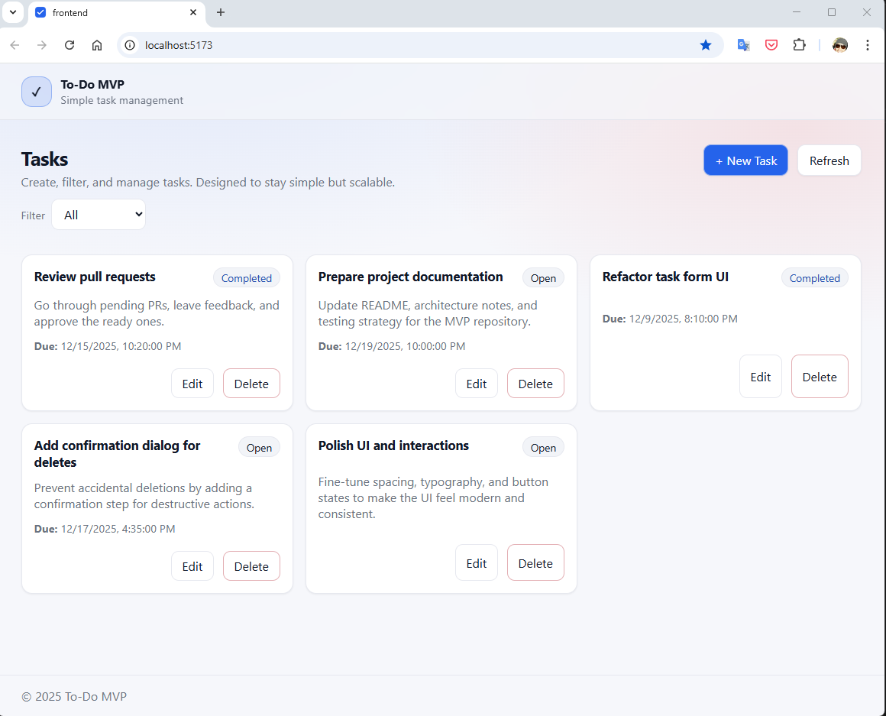
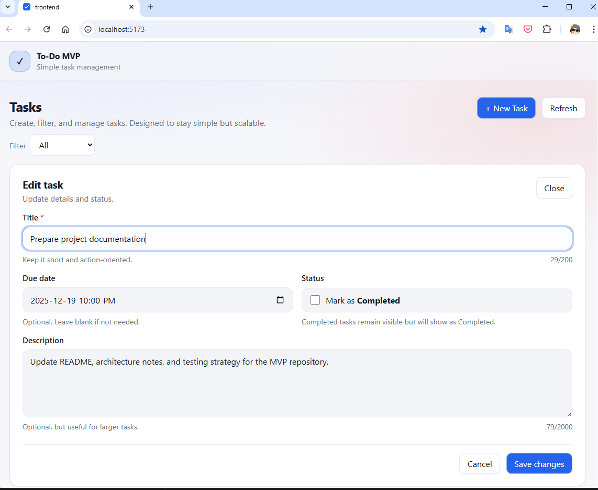
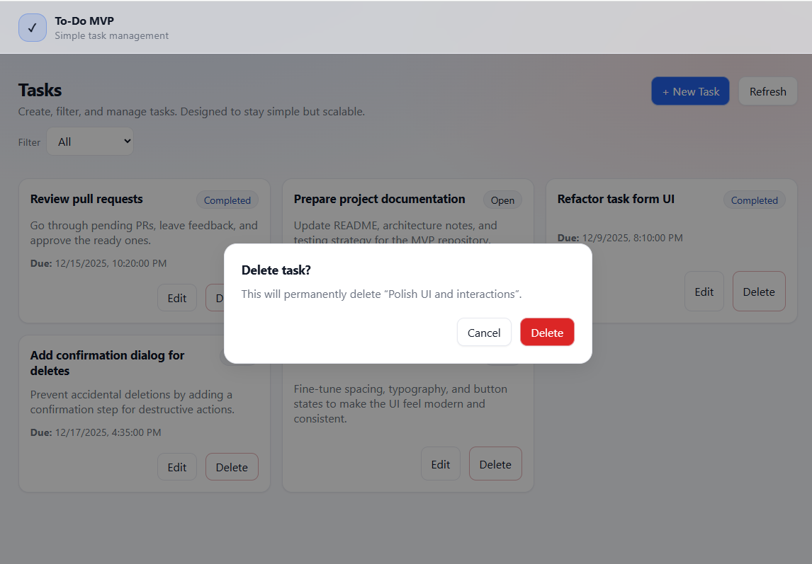

# To-Do Task Management MVP

A small but production-minded **Task Management** application built with a **.NET Core backend** and a **React frontend**.  
The goal is to demonstrate **clean architecture, clear API design, and automated testing** while keeping the feature set intentionally minimal.  

[](https://github.com/SaeidSabz/todo-mvp/actions/workflows/ci.yml)


---

## 1. Overview

This repository contains:

- A **backend API** (C# / .NET 10 / EF Core InMemory) exposing RESTful JSON endpoints for managing tasks.
- A **frontend** (React + TypeScript) that consumes the API and provides a simple UI for:
  - Creating tasks
  - Viewing and filtering tasks
  - Updating tasks (including status)
  - Deleting tasks

The system is designed as an **MVP**, with a clear path toward a more production-ready application (real database, authentication, multi-user support, etc.).

---

## 2. UI Preview

The UI is intentionally simple, responsive, and production-oriented.  
It focuses on clarity, accessibility, and predictable user interactions rather than visual complexity.



<details>
  <summary>More screenshots</summary>

  **Create / Edit task**
  
  

  **Delete confirmation**
  
  
</details>

---

## 3. Tech Stack

### Backend
- .NET 10 Web API
- EF Core (InMemory provider)
- Clean Architecture–inspired layering (Api / Application / Domain / Persistence)
- NUnit for unit testing

### Frontend
- React 19
- TypeScript
- Vite
- Vitest + React Testing Library for unit/component tests

---

## 4. Repository Structure

```text
todo-mvp/
├─ README.md
├─ docs/
│  ├─ 01-Product-Vision.md
│  ├─ 02-Architecture-Overview.md
│  ├─ 03-Functional-Requirements.md
│  ├─ 04-NonFunctional-Requirements.md
│  ├─ 05-API-Spec.md
│  ├─ 06-Data-Model.md
│  ├─ 07-Frontend-Design.md
│  ├─ 08-Testing-Strategy.md
│  └─ 09-Future-Scalability.md
└─ src/
   ├─ backend/
   │  └─ TodoMvp/
   │     ├─ TodoMvp.slnx
   │     ├─ TodoMvp.Api/
   │     ├─ TodoMvp.Api.Tests/
   │     ├─ TodoMvp.Application/
   │     ├─ TodoMvp.Domain/
   │     └─ TodoMvp.Persistence/
   └─ frontend/
```

## 5. Documentation

All key decisions and requirements are documented in `/docs`:

- [01 – Product Vision](docs/01-Product-Vision.md)  
- [02 – Architecture Overview](docs/02-Architecture-Overview.md)  
- [03 – Functional Requirements](docs/03-Functional-Requirements.md)  
- [04 – Non-Functional Requirements](docs/04-NonFunctional-Requirements.md)  
- [05 – API Specification](docs/05-API-Spec.md)  
- [06 – Data Model](docs/06-Data-Model.md)  
- [07 – Frontend Design](docs/07-Frontend-Design.md)  
- [08 – Testing Strategy](docs/08-Testing-Strategy.md)  
- [09 – Future & Scalability Notes](docs/09-Future-Scalability.md)  

These documents are the **source of truth** for architecture and design decisions.  

---

## 6. Getting Started (High-Level)

### 6.1 Prerequisites

- .NET SDK **10**
- Node.js **20+**
- npm  

### 6.2 Clone the Repository

Clone the project:
```bash
git clone <repo-url> todo-mvp
cd todo-mvp
```


### 6.3 Run the Backend (TodoMvp.Api)

The backend solution is located under ```src/backend/TodoMvp```.
```bash
cd src/backend/TodoMvp
dotnet run --project TodoMvp.Api
```

Example output:
```text
Now listening on: https://localhost:7157
Now listening on: http://localhost:5157
```

Health Check
```text
GET https://localhost:7157/api/health
```

Example response:
```json
{
  "status": "ok",
  "timestampUtc": "2025-01-01T12:00:00Z"
}
```

### 6.4 Run the Frontend

```bash
cd src/frontend
npm install
npm run dev
```

Environment variable required:

```env
VITE_API_BASE_URL=https://localhost:7157
```

---  
## 7. Testing
### Backend Tests
```bash
cd src/backend/TodoMvp
dotnet test
```

### Frontend Tests (Jest)
```bash
cd src/frontend
npm test
```

Exact commands and test project locations will be defined once the implementation is added.  
See [08 – Testing Strategy](docs/08-Testing-Strategy.md) for detailed testing plans.

---

## 8. Assumptions, Trade-offs

- Single-user context (no authentication) for simplicity.
- EF Core InMemory is used to avoid database setup overhead.
- Client-side filtering and state management
- Emphasis on correctness, testability, and structure over feature breadth

Planned future improvements (beyond MVP) are described in:

- [09 – Future & Scalability Notes](docs/09-Future-Scalability.md)

---

## 9. Contribution and Review

This repository is structured to be easy to **review**

- Design documents first (in `docs/`).
- Clean separation between backend and frontend (in `src/`).
- Automated tests and CI from the start

---  

## 10. License

This project is licensed under the **MIT License**.

See the [LICENSE](LICENSE) file for details.
